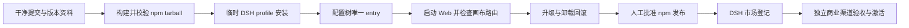

# feat: 发布 DSH FreeCanvas 到插件市场

## Overview

把 `plugins/dsh-freecanvas` 从“仓库内可运行的 DSH bundle”推进为可由普通用户从 DSH 插件市场安装、升级和卸载的正式 npm 包。发布链路必须能重复验证预构建资源、bundle manifest、干净 profile 安装、实际启动和卸载回滚；官方 KIE 媒体渠道继续默认关闭，不把尚未完成的商业验收混入基础插件发布。

## Problem Frame

当前插件已经声明 `dsh.bundle.patch` 和 Web Client，`npm pack --dry-run` 能生成包含内置画布的包，宿主测试也已通过；但 npm 尚无 `dsh-plugin-freecanvas`，当前工作区仍有未提交变更，也没有可重复执行的干净 DSH profile 安装/启动/卸载证据。因此现状只能证明“技术结构接近可发布”，不能证明市场用户拿到的 tarball 能正常安装和运行。

本计划以基础画布插件先上架为目标。KIE Key、点数、卡密和生产 New API 属于独立商业上线边界；市场版本可以包含默认关闭的官方渠道代码，但不得宣称它已商业开放。

## Requirements Trace

- R1. npm 包必须能通过 `dsh plugin --profile web add dsh-plugin-freecanvas@<version>` 安装，并让 bundle 配置层恰好出现一次。
- R2. 包必须包含宿主入口、客户端入口、`cordis.patch.yml`、内置 `web/`、许可证和第三方声明，安装后不依赖 Vite、Docker 或额外的 3000 端口。
- R3. 发布前必须在一次性 DSH profile 中验证安装、配置树、Web 启动、画布路由、升级和卸载，不污染用户现有 profile。
- R4. pull request 和发布 tag 必须运行可重复的 package/host/clean-install 检查，失败时不得发布。
- R5. npm 元数据、GitHub 仓库信息、README、版本、Changelog 和市场展示信息必须一致，并保留上游致谢与许可证边界。
- R6. 官方 KIE 渠道在市场版本中继续默认关闭；插件包、浏览器资源、日志和发布产物不得包含 KIE Key、设备 Token、卡密或配对码。
- R7. 发布必须来自干净提交，插件 package 版本、插件 Changelog 版本段和插件专用 Git tag 保持一致，并可通过固定版本回滚；根项目 `VERSION` 保持独立。

## Scope Boundaries

- 本计划不启用 `officialChannelEnabled`，不部署 New API，不调用 KIE，也不替代现有商业激活 TODO `008`。
- 本计划不实现 KIE `Channel.Key` 应用层加密；该项属于 New API 生产安全加固，不应与基础插件 npm 发布混在一个变更中。
- 本计划不替换当前 `@basketikun/canvas-agent` 依赖；自有 Canvas Agent npm 包仍按现有长期 TODO 独立推进。
- 未获得 npm/市场账号授权前，只准备发布配置和候选产物，不执行真实 `npm publish`、市场提交或 tag 发布。
- 不新增画布业务功能或顺手重构现有 UI。

## Context & Research

### Relevant Code and Patterns

- `plugins/dsh-freecanvas/package.json` 已包含 `exports`、`files`、`dsh.bundle`、`dsh.client`、`prepack`、仓库和许可证元数据。
- `plugins/dsh-freecanvas/cordis.patch.yml` 使用包名插入唯一的 `ui-dsh-freecanvas` entry，符合 out-of-tree bundle 方式。
- `plugins/dsh-freecanvas/scripts/build-web.mjs` 已将根 `web/` 构建为带 `/dsh-freecanvas/` base 的包内静态资源。
- `plugins/dsh-freecanvas/test/*.test.js` 已覆盖布局持久化、官方渠道默认关闭、同源代理和设备令牌边界。
- `.github/workflows/publish-plugins.yml` 发布的是画布内部插件清单到 `plugins-dist`，不能复用为 DSH npm bundle 发布流程。
- `docs/content/docs/progress/pending-test.zh-CN.mdx` 已记录真实 bundle 安装、重启和卸载验收要求。

### Institutional Learnings

- “已实现”“本地测试”“已配置”“生产可用”必须分开；package dry-run 不能替代实际 DSH profile 安装和启动。
- 普通用户路径应以 DSH 插件市场/侧边栏为准，源码命令只用于开发和排障。
- 官方渠道继续 fail closed；真实 KIE、退款、日志脱敏、商业授权和运营批准完成前不得激活。

### External References

- DSH 官方打包说明：`https://github.com/deepseek-ai/deepseek-harness/blob/master/docs/user/develop/basic/publish.md`
- DSH CLI/Profile 参考：`https://github.com/deepseek-ai/deepseek-harness/blob/master/apps/cli/reference/README.md`
- 规划时 npm 当前 `@deepseek-ai/dsh` 版本为 `0.1.1-rc.2`；CI 固定验证版本，另设显式的 latest 兼容探测，不让上游漂移悄然改变正式发布结果。

## Key Technical Decisions

- **npm 预构建包作为正式分发单元：** 仓库根目录不是插件包根，直接 GitHub 安装也不能稳定表达子目录；npm 包和 tarball 能明确携带预构建 `lib/`、`web/` 与许可证文件。
- **固定 DSH 基线加非阻断兼容探测：** 正式 gate 固定到已验证版本，latest 探测只报告兼容漂移；确认兼容后再提升固定版本。
- **一次性 profile 验收：** 所有自动安装测试使用临时 `DSH_HOME`，并检查安装前后配置树，避免更改用户 Desktop profile。
- **基础市场发布与付费渠道激活解耦：** 默认关闭的官方渠道代码可随包发布，但市场文案只描述已验证的基础画布能力。
- **可信发布而非长期 npm Token 优先：** GitHub Actions 发布优先使用 npm Trusted Publishing/OIDC 与 provenance；若账号暂不支持，短期 token 也只能放 GitHub Environment secret，并保留人工审批。

## Open Questions

### Resolved During Planning

- 市场版本是否必须等 KIE 商业化完成：不需要；基础插件可先发布，官方渠道保持关闭且不作为市场已开放能力宣传。
- 正式安装源：使用 npm 包；tarball 用于发布候选验收和离线回滚。
- 发布兼容基线：先固定 `@deepseek-ai/dsh@0.1.1-rc.2`，后续通过兼容探测升级。

### Deferred to Implementation

- DSH 当前内置市场实际采用哪个公共 catalog/提交流程：在 npm 包可公开安装后，通过 Desktop 当前市场入口确认；登记属于外部发布动作，需要单独授权。
- npm Trusted Publisher 的组织/仓库授权是否已配置：只有仓库所有者能在 npm 后台完成，发布 workflow 落地后由运营设置。
- Desktop 打包环境对 `@deepseek-ai/dsh-settings` 的实际解析版本：由干净 CLI profile 和真实 Desktop 两层验收确认，再收紧 peer range。

## High-Level Technical Design

> *This illustrates the intended approach and is directional guidance for review, not implementation specification. The implementing agent should treat it as context, not code to reproduce.*

## Implementation Units

- [x] **Unit 1: 加固发布包契约与静态验证**

**Goal:** 让仓库能自动拒绝缺失入口、资源、许可证、错误版本范围或疑似密钥的发布候选包。

**Requirements:** R2, R4, R5, R6

**Dependencies:** None

**Files:**
- Modify: `plugins/dsh-freecanvas/package.json`
- Create: `plugins/dsh-freecanvas/CHANGELOG.md`
- Create: `plugins/dsh-freecanvas/scripts/verify-package.mjs`
- Create: `plugins/dsh-freecanvas/test/package-release.test.js`
- Modify: `plugins/dsh-freecanvas/README.md`
- Modify: `CHANGELOG.md`
- Modify: `docs/content/docs/progress/pending-test.mdx`
- Modify: `docs/content/docs/progress/pending-test.zh-CN.mdx`

**Approach:**
- 把 package manifest、bundle patch 和 pack file list 作为明确契约校验，不依赖人工阅读 `npm pack` 输出。
- 校验预构建入口、内置 Web、许可证、第三方声明、仓库元数据、公开包访问级别和 Node/DSH 兼容范围。
- 对 pack file list 和文本发布文件运行最小敏感信息检查；只识别明确凭据模式，不扫描或输出本机环境变量。
- 提供一个不会发布、不会写入 npm registry 的本地 `verify:package` 入口。

**Execution note:** 先为 manifest/file-list 校验添加失败场景，再实现校验器；打包子进程只在集成场景运行。

**Patterns to follow:**
- `plugins/dsh-freecanvas/test/official-api-proxy.test.js` 的 Node 原生测试风格。
- `plugins/dsh-freecanvas/scripts/build-web.mjs` 的短小 ESM 脚本和明确失败方式。

**Test scenarios:**
- Happy path：当前 manifest、patch 和 dry-run pack 文件清单全部满足契约时通过。
- Error path：缺少 `dsh.bundle.patch`、客户端入口、宿主入口、`web/index.html`、ELv2 或第三方声明时分别失败并给出文件级原因。
- Error path：package 名称、patch entry 名称或版本资料不一致时拒绝候选包。
- Security：候选文本文件包含 KIE Key、设备 Token、卡密/配对码真实模式时拒绝，测试仅使用虚构固定样本且错误输出不回显完整值。
- Integration：`npm pack --dry-run --ignore-scripts --json` 的真实输出可被校验器消费，并确认没有生成 `.tgz` 文件。

**Verification:**
- 一条本地验证命令能给出明确成功结果；任一必需文件或 manifest 字段被移除时测试和验证均失败。

- [x] **Unit 2: 自动化干净 DSH 安装与启动验收**

**Implementation status:** 本机与 GitHub Actions run `32721242203` 均已使用真实 `@deepseek-ai/dsh@0.1.1-rc.2` 完成候选 tarball 的安装、重复安装、Web 启动、官方渠道禁用检查、卸载和基础 Web 重启；全新 runner 的 package lifecycle job `97412930000` 已通过，本单元关闭。

**Goal:** 在 CI 中证明 tarball 能被当前 DSH 安装、组成配置树、启动内置画布并完整卸载。

**Requirements:** R1, R2, R3, R4, R6

**Dependencies:** Unit 1

**Files:**
- Create: `plugins/dsh-freecanvas/scripts/verify-dsh-install.mjs`
- Create: `plugins/dsh-freecanvas/test/dsh-install-contract.test.js`
- Create: `.github/workflows/dsh-freecanvas-package.yml`
- Modify: `plugins/dsh-freecanvas/package.json`
- Modify: `plugins/dsh-freecanvas/README.md`
- Modify: `docs/content/docs/progress/pending-test.mdx`
- Modify: `docs/content/docs/progress/pending-test.zh-CN.mdx`
- Modify: `CHANGELOG.md`

**Approach:**
- 在临时目录生成真实 tarball，并使用临时 `DSH_HOME` 和固定 DSH CLI 版本执行安装。
- 安装后检查 profile manifest 与 `--dump-config`，要求 `ui-dsh-freecanvas` 和 bundle 层各出现一次。
- 启动一次 Web profile，检查 `/dsh-freecanvas/`、静态资源和状态接口；测试 profile 明确保持官方渠道关闭且不访问 KIE。
- 执行升级/重复安装和卸载，确认其他 profile bundle 不被改动，所有子进程均在超时或结束时可靠清理。
- CI 固定 Node 24 和 DSH 基线版本；另行报告 latest 兼容性但不让漂移直接阻断已批准发布。

**Execution note:** 使用真实 CLI 和临时文件系统做集成验证；只对外部 npm 下载使用网络，不 mock DSH 配置组成过程。

**Patterns to follow:**
- DSH 官方 `dsh plugin --profile ... add`、`--dump-config` 和 tarball 安装流程。
- 现有宿主测试中临时目录、随机本地端口和可靠清理方式。

**Test scenarios:**
- Happy path：tarball 安装成功，bundle/profile 只包含一个 FreeCanvas 层，画布首页和静态资源返回成功。
- Edge case：重复安装同版本不会产生重复 entry；升级到同一候选版本保持配置可解析。
- Error path：缺失 bundle patch 或 Web 资源的合成坏包在启动前失败，并保留可诊断输出。
- Security：临时 profile 中官方渠道默认关闭，状态接口不返回门户、Token 或上游信息，测试期间没有 KIE 请求。
- Integration：卸载后 FreeCanvas bundle 和依赖消失，基础 Web profile 仍能生成配置树并启动。

**Verification:**
- GitHub Actions 能从全新 runner 完成 build、host tests、pack、install、boot、remove 全链路，且不依赖仓库外本地文件。

- [x] **Unit 3: 完成真实 Desktop 安装、重启、升级和卸载验收**

**Goal:** 在用户实际 DSH Desktop 环境证明 CI 无法覆盖的侧边栏、分屏、Agent 冷启动和卸载行为。

**Requirements:** R1, R2, R3, R5

**Dependencies:** Unit 2

**Files:**
- Modify: `docs/content/docs/progress/pending-test.mdx`
- Modify: `docs/content/docs/progress/pending-test.zh-CN.mdx`
- Modify after user acceptance: `docs/content/docs/overview/features.mdx`
- Modify after user acceptance: `docs/content/docs/overview/features.zh-CN.mdx`

**Approach:**
- 使用候选 tarball 和隔离 Desktop profile，不先覆盖用户日常 profile。
- 验证安装、完整重启、侧边栏入口、会话/分屏/画布模式、Canvas Agent 自动启动、MCP 只读调用和卸载。
- 保留版本、tarball SHA256、DSH/Desktop 版本和脱敏结果；不记录 Token、配对码或本地隐私路径。

**Test scenarios:**
- Happy path：重启后插件不再卡在加载页，内置画布无需外部服务即可打开并恢复布局。
- Integration：Canvas Agent 自动启动，健康检查可用，一次只读画布 MCP 调用成功。
- Edge case：重复安装/升级后只保留一个入口，已有本地画布数据和布局不丢失。
- Error path：卸载后入口和 bundle 消失，其他 DSH 插件及 profile 配置保持不变。
- Security：官方渠道仍关闭，浏览器网络和 DSH 日志没有设备 Token 或 KIE Key。

**Verification:**
- 最终候选包 SHA256 `2e3ff2db70e99584674930d1e36151ed29007b64cb8660266f568a0fa60e649f` 已在 DSH Desktop `2.0.1`、内置 DSH `0.1.0-rc.7` 的隔离 profile 中通过首次启动、完整冷启动、布局恢复、Canvas Agent 健康检查、34 项 MCP 工具清单与只读调用、非空画布与无敏感测试渠道跨新端口保留、卸载隔离和日常 profile 恢复；修复过程中的同版本重装也验证了非空画布保留。验收中发现并修复了 Desktop 动态端口导致浏览器 origin 变化后画布和用户配置丢失的问题；修复后业务数据与配置写入权限为 `0700`/`0600` 的宿主本地存储。正式功能说明仍等待用户确认 pending-test 结果后更新。

- [ ] **Unit 4: 建立受控 npm 发布与回滚流程**

**Implementation status:** 受控 workflow、插件专用发布契约、首次发布 bootstrap token 边界、后续 Trusted Publishing/OIDC 切换和回滚说明已实现；npm `npm-production` Environment、首次外部发布、首发后 OIDC 切换与 registry 实证仍等待仓库所有者配置及单独授权，因此本单元保持未完成。

**Goal:** 从已验收提交发布带 provenance 的固定版本 npm 包，并能回滚到上一已知版本。

**Requirements:** R4, R5, R7

**Dependencies:** Unit 2, Unit 3, npm 所有者配置

**Files:**
- Create: `.github/workflows/publish-dsh-freecanvas.yml`
- Modify: `plugins/dsh-freecanvas/package.json`
- Modify: `plugins/dsh-freecanvas/CHANGELOG.md`
- Modify: `plugins/dsh-freecanvas/README.md`

**Approach:**
- 发布 workflow 只接受 `dsh-plugin-freecanvas@<version>` 形式的插件专用 tag 或人工 dispatch，并绑定受保护 GitHub Environment；不得触发根项目 `v*` 发版流程。
- 先重复运行 Unit 1/2 gate，再核对插件 tag、package 版本与插件 Changelog；任何不一致均 fail closed，根项目 `VERSION` 不参与插件版本判断。
- 优先使用 npm Trusted Publishing/OIDC 和 provenance，不在仓库、日志或构建产物中保存长期 npm Token。
- 发布后只读核对 registry 元数据、integrity、安装命令和 tarball；失败时不覆盖同版本，使用新补丁版本修复。

**Test scenarios:**
- Happy path：匹配版本的已批准 tag 通过所有 gate 后发布 public 包并可从 registry 读取。
- Error path：脏提交无法形成发布 tag；插件 tag/package/插件 Changelog 任一不一致时拒绝。
- Error path：缺少 npm OIDC/Environment 授权时停在发布前，不产生半发布状态。
- Security：workflow 权限最小化，日志不出现 token，产物附 provenance 与可复核 integrity。
- Rollback：上一固定版本仍可安装；问题版本通过 deprecate/市场下架提示处理，不尝试覆盖已发布版本。

**Verification:**
- `dsh-plugin-freecanvas@<version>` 在 npm 可见、可固定安装，registry tarball 与候选包校验值一致。

- [ ] **Unit 5: 登记 DSH 市场并完成发布后验收**

**Goal:** 让普通用户能在 DSH 插件市场发现插件，并从侧边栏完成首次使用。

**Requirements:** R1, R3, R5, R6, R7

**Dependencies:** Unit 4, 市场维护方/账号授权

**Files:**
- Modify: `README.md`
- Modify: `plugins/dsh-freecanvas/README.md`
- Modify: `docs/content/docs/overview/quick-start.mdx`
- Modify: `docs/content/docs/overview/quick-start.zh-CN.mdx`
- Modify: `docs/content/docs/overview/dsh-plugin.mdx`
- Modify: `docs/content/docs/overview/dsh-plugin.zh-CN.mdx`
- Modify: `docs/content/docs/progress/todo.mdx`
- Modify: `docs/content/docs/progress/todo.zh-CN.mdx`

**Approach:**
- 用已发布 npm 精确版本和仓库所有权资料提交当前 DSH 市场所需 catalog/表单/PR。
- 展示名称统一为 DSH FreeCanvas，安装 spec 指向 npm 包，不把仓库子目录或开发命令作为普通用户路径。
- 市场文案只描述已验收能力，明确本地存储、第三方上游和许可证边界；不宣传默认 KIE 付费渠道已开放。
- 上架后从一台没有源码 checkout 的环境完成搜索、安装、启动、升级与卸载复验。

**Test scenarios:**
- Happy path：市场搜索命中唯一插件，安装 spec 解析到已发布 npm 固定版本。
- Integration：从市场安装后侧边栏入口、内置画布、Agent 自动连接与卸载均正常。
- Error path：市场元数据版本落后或 npm 包不可解析时停止推广并保留上一稳定版本。
- Security：市场和文档不包含服务端地址、KIE Key、设备 Token、卡密、配对码或 npm 凭据。

**Verification:**
- 普通用户无需克隆仓库或启动额外服务即可在市场发现、安装并打开 DSH FreeCanvas；发布记录包含版本、SHA、验证结果和回滚目标。

## System-Wide Impact

- **Interaction graph:** Git tag/人工发布 → GitHub Actions → npm registry → DSH market catalog → `dsh plugin add` → profile bundle composition → host/client/内置 Web/Canvas Agent。
- **Error propagation:** 静态包契约、host tests、clean install、Desktop acceptance 任一失败都阻断下一层；npm/市场外部失败不得改变官方渠道开关。
- **State lifecycle risks:** 安装会修改 profile `package.json`、lockfile 和 bundles；临时验收必须隔离，真实卸载必须证明不删除其他插件状态。
- **API surface parity:** npm 元数据、市场展示、README、文档导航和插件设置描述必须使用同一名称、版本和许可证边界。
- **Integration coverage:** dry-run 只证明文件清单；真实 CLI profile 证明包组成；Desktop 验收证明客户端加载、布局和 Agent 生命周期。
- **Unchanged invariants:** 画布业务数据继续保存在浏览器本地；用户自定义渠道继续可用；官方 KIE 渠道继续默认关闭并 fail closed。

## Risks & Dependencies

| Risk | Mitigation |
|------|------------|
| DSH release candidate 更新导致插件突然不兼容 | 固定已验收版本作为 gate，latest 仅报告；确认后再更新基线 |
| `@deepseek-ai/dsh-settings` peer range 与 Desktop 实际版本漂移 | clean CLI 与 Desktop 双重验证，根据实测调整范围，不盲目放宽 |
| npm 子目录发布遗漏构建资源 | prepack + pack file-list 契约 + tarball clean install 三层验证 |
| workflow 意外发布或泄露 npm 凭据 | 受保护 Environment、OIDC/provenance、最小权限、人工批准 |
| 市场上架后官方 KIE 被误认为可用 | 默认关闭、市场文案排除、状态接口 fail closed、商业激活独立审批 |
| 上游 Canvas Agent 包撤回或不兼容 | 固定精确版本并纳入 clean install；自有包迁移仍由独立 TODO 处理 |
| ELv2 与上游 MIT 展示不一致 | tarball 必检 LICENSE/LICENSING/THIRD_PARTY_NOTICES，市场文案保持组件边界 |

## Phased Delivery

### Phase 1: Release candidate engineering

- Unit 1-2：完成自动发布包契约和干净 DSH 生命周期验证。

### Phase 2: Human/Desktop acceptance

- Unit 3：使用候选 tarball 在隔离 Desktop profile 完成真实验收。

### Phase 3: External publication

- Unit 4-5：取得 npm/市场授权后发布、登记、复验和保留回滚证据。

### Separate commercial phase

- 继续由 TODO `008` 管理 KIE 生产 HTTPS、真实计费/退款、日志脱敏、商业授权、密钥保护和最终渠道激活。

## Documentation / Operational Notes

- 计划与实现进度先写入 `todo.mdx` / `pending-test.mdx`；只有用户确认真实 Desktop 测试通过后才更新正式 features 文档。
- 每个候选版本保留 npm 版本、Git SHA、tarball SHA256、DSH 基线版本、Desktop 版本、安装/卸载结论和回滚版本，不保存任何秘密。
- npm 发布和市场登记属于外部不可逆动作，必须在本地与 Desktop gate 完成后单独确认。

## Sources & References

- Related package: `plugins/dsh-freecanvas/package.json`
- Related patch: `plugins/dsh-freecanvas/cordis.patch.yml`
- Related tests: `plugins/dsh-freecanvas/test/`
- Existing acceptance list: `docs/content/docs/progress/pending-test.zh-CN.mdx`
- Commercial activation gate: `.context/compound-engineering/todos/008-pending-p1-validate-and-activate-paid-channel.md`
- DSH package/install guide: `https://github.com/deepseek-ai/deepseek-harness/blob/master/docs/user/develop/basic/publish.md`
- DSH CLI reference: `https://github.com/deepseek-ai/deepseek-harness/blob/master/apps/cli/reference/README.md`
